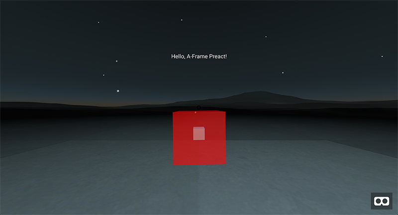
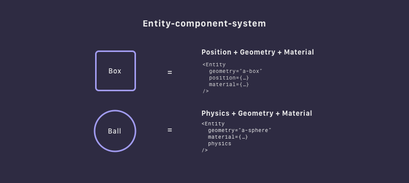
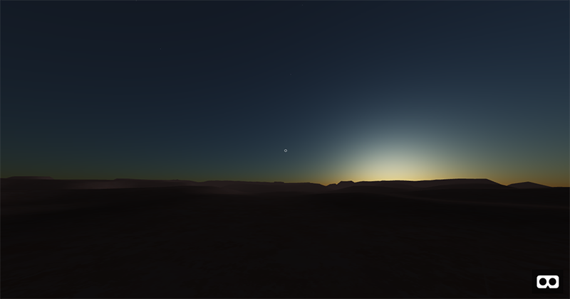
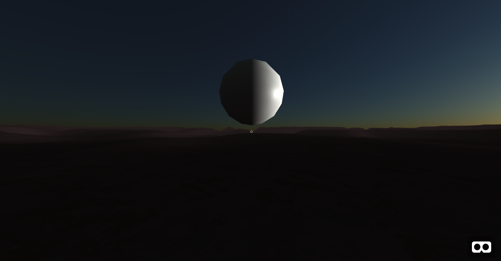
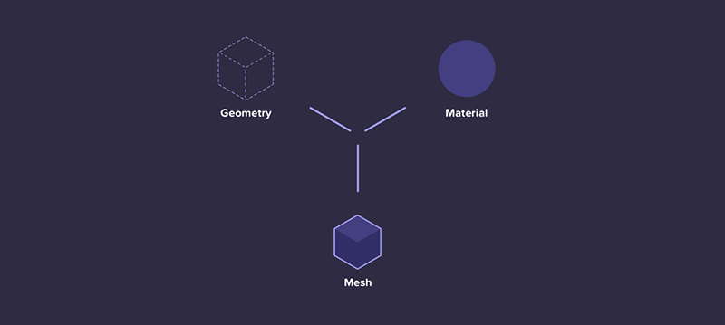
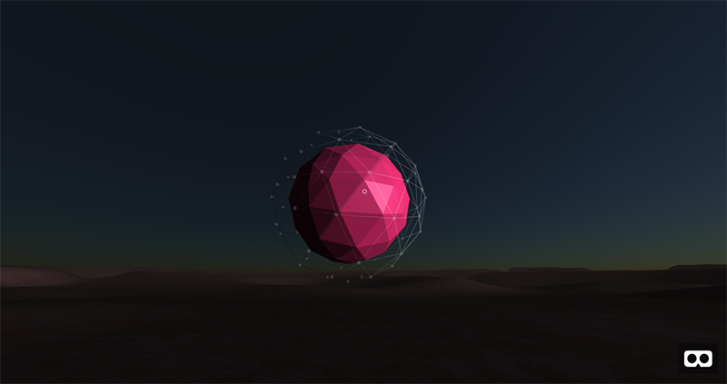
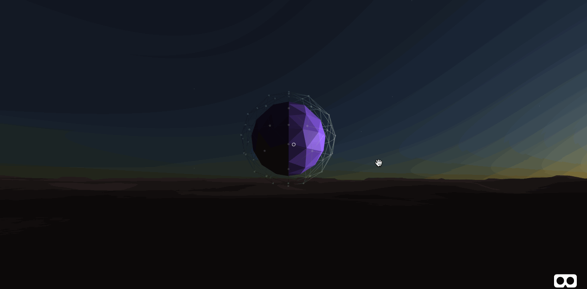
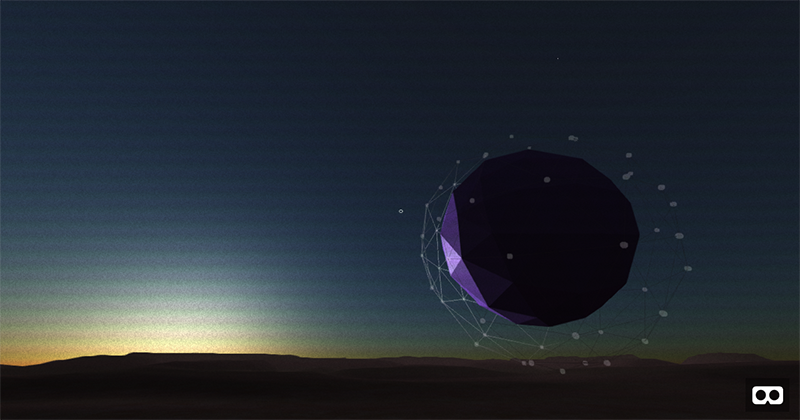
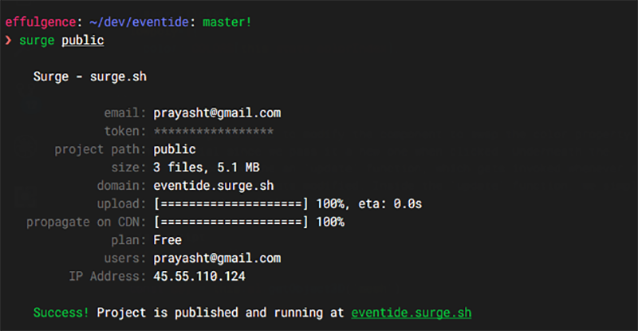

# Creating Your First WebVR App using A-Frame and React

### Building VR apps has never been easier. Combine that with the power and accessibility of the web, and you get WebVR.

Today, we'll be running through a short tutorial on creating our own WebVR application using [A-Frame](https://aframe.io/) and [React](https://facebook.github.io/react/). We'll cover the setup process, build out a basic 3D scene, and add interactivity and animation. A-Frame has an excellent third-party component registry, so we will be using some of those in addition to writing one from scratch. In the end, we'll go through the deployment process through [surge](https://surge.sh/) so that you can share your app with the world and test it out live on your smartphone (or Google Cardboard if you have one available). For reference, the final code is in [this repo](https://github.com/prayasht/eventide). Over the course of this tutorial, we will be building a scene like this. Check out the [live demo](http://eventide.surge.sh) as well.


Exciting, right? Without further ado, let's get started!

## What is A-Frame?


A-Frame is a framework for building rich 3D experiences on the web. It's built on top of three.js, an advanced 3D JavaScript library that makes working with WebGL extremely fun. The cool part is that A-Frame lets you build WebVR apps without writing a single line of JavaScript (to some extent). You can create a basic scene in a few minutes writing a [couple lines of HTML](https://codepen.io/prayasht/pen/EvderE?editors=1000). It provides an excellent HTML API for you to scaffold out the scene, while still giving you full flexibility by letting you access the rich three.js API that powers it. In my opinion, A-Frame strikes an excellent balance of abstraction this way. The [documentation](https://aframe.io/docs/0.6.0/introduction/) is an excellent place to learn more about it in detail.

## Setup
The first thing we're going to be doing is setting up A-Frame and React. I've already gone ahead and done that for you so you can simply clone [this repo](https://github.com/prayasht/aframe-preact-starter), `cd` into it, and run `yarn install` to get all the required dependencies. For this app, we're actually going to be using [Preact](http://preactjs.com), a fast and lightweight alternative to React, in order to reduce our bundle size. Dont worry, it's still the same API so if you've worked with React before then you shouldn't notice any differences. Go ahead and run `yarn start` to fire up the development server. Hit up http://localhost:3333 and you should be presented with a basic scene including a spinning cube and some text. I highly suggest that you spend some time going through the README in that repo. It has some essential information about A-Frame and React. It also goes more into detail on what and how to install everything. Now on to the fun stuff.



## Building Blocks
Fire up the editor on the root of the project directory and inspect the file `app/main.js`, that's where we'll be building out our scene. Let's take a second to break this down.

The `Scene` component is the root node of an A-Frame app. It's what creates the stage for you to place 3D objects in, initializes the camera, the WebGL renderer and handles other boilerplate. It should be the outermost element wrapping everything else inside it. You can think of `Entity` like an HTML `div`. Entities are the basic building blocks of an A-Frame `Scene`. Every object inside the A-Frame scene is an `Entity`.

A-Frame is built on the [Entity-component-system](https://en.wikipedia.org/wiki/Entity-component-system) (ECS) architecture, a very common pattern utilized in 3D and game development most notably popularized by [Unity](https://unity3d.com/), a powerful game engine. What ECS means in the context of an A-Frame app is that we create a bunch of Entities that quite literally do nothing, and attach components to them to describe their behavior and appearance. Because we're using React, this means that we'll be passing props into our `Entity` to tell it what to render. For example, passing in `a-box` as the value of the prop `primitive` will render a box for us. Same goes for `a-sphere`, or `a-cylinder`. Then we can pass in other values for attributes like `position`, `rotation`, `material`, `height`, etc. Basically, anything listed in the A-Frame [documentation](https://aframe.io/docs/0.6.0/core/entity.html) is fair game. I hope you see how powerful this really is. You're grabbing just the bits of functionality you need and attaching them to Entities. It gives us maximum flexibility and reusability of code, and is very easy to reason about. This is called [composition over inheritance](https://en.wikipedia.org/wiki/Composition_over_inheritance).



## But, Why React?
Sooooo, all we need is markup and a few scripts. What's the point of using React, anyway? Well, if you wanted to attach state to these objects, then manually doing it would be a lot of hard work. A-Frame handles almost all of its rendering through the use of HTML attributes (or components as mentioned above), and updating different attributes of many objects in your scene manually can be a massive headache. Since React is excellent at binding state to markup, diffing it for you, and re-rendering, we'll be taking advantage of that. Keep in mind that we won't be handling any WebGL render calls or manipulating the animation loop with React. A-Frame has a built in animation engine that handles that for us. We just need to pass in the appropriate props and let it do the hard work for us. See how this is pretty much like creating your ordinary React app, except the result is WebGL instead of raw markup? Well, technically, it is still markup. But A-Frame converts that to WebGL for us. Enough with the talking, let's write some code.

## Setting Up the Scene
The first thing we should do is to establish an environment. Let's start with a blank slate. Delete everything inside the `Scene` element. For the sake of making things look interesting right away, we'll utilize a 3rd party component to generate a nice environment for us. 3rd party components pack a lot of WebGL code inside them, but expose a very simple interface in the markup. It's already been imported in the `app/intialize.js` file so all we need to do is attach it to the `Scene` element. I've already configured some nice defaults for us to get started, but feel free to modify to your taste. As an aside, you can press `CTRL + ALT + I` to load up the A-Frame Scene Inspector and change parameters in real-time. I find this super handy in the initial stage when designing the app. Our file should now look something like:

```javascript
import { h, Component } from 'preact'
import { Entity, Scene } from 'aframe-react'

class App extends Component {
  constructor() {
    super()

    // We'll use this state later on in the tutorial
    this.state = {
      colorIndex: 0,
      spherePosition: { x: 0.0, y: 4, z: -10.0 }
    }
  }

  render() {
    return (
      <Scene
        environment={{
          preset: 'starry',
          seed: 2,
          lightPosition: { x: 0.0, y: 0.03, z: -0.5 },
          fog: 0.8,
          ground: 'canyon',
          groundYScale: 6.31,
          groundTexture: 'walkernoise',
          groundColor: '#8a7f8a',
          grid: 'none'
        }}
      >
      </Scene>
    )
  }
}
```



Was that too easy? That's the power of A-Frame components. Don't worry. We'll dive into writing some of our own stuff from scratch later on. We might as well take care of the camera and the cursor here. Let's define another `Entity` inside the `Scene` tags. This time, we'll pass in different primitives (`a-camera` and `a-cursor`).

```javascript
<Entity primitive="a-camera" look-controls>
  <Entity
    primitive="a-cursor"
    cursor={{ fuse: false }}
    material={{ color: 'white', shader: 'flat', opacity: 0.75 }}
    geometry={{ radiusInner: 0.005, radiusOuter: 0.007 }}
  />
</Entity>
```

See how readable and user-friendly this is? It's practically English. You can look up every single prop here in the A-Frame docs. Instead of string attributes, I'm passing in objects.

## Populating the Environment
Now that we've got this sweet scene set up, we can populate it with objects. They can be basic 3D geometry objects like cubes, spheres, cylinders, octahedrons, or even custom 3D models. For the sake of simplicity, we'll use the defaults provided by A-Frame, and then write our own component and attach it to the default object to customize it. Let's build a low poly count sphere because they look cool. We'll define another entity and pass in our attributes to make it look the way we want. We'll be using the `a-octahedron` primitive for this. This snippet of code will live in-between the `Scene` tags as well.

```javascript
<Entity
  primitive="a-octahedron"
  detail={2}
  radius={2}
  position={this.state.spherePosition}
  color="#FAFAF1"
/>
```

You may just be seeing a dark sphere now. We need some lighting. Let there be light:
```javascript
<Entity
  primitive="a-light"
  type="directional"
  color="#FFF"
  intensity={1}
  position={{ x: 2.5, y: 0.0, z: 0.0 }}
/>
```



## Building Your First A-Frame Component
Baby steps. We now have a 3D object and an environment that we can walk/look around in. Now let's take it up a notch and build our own custom A-Frame component from scratch. This component will alter the appearance of our object, and also attach interactive behavior to it. Our component will take the provided shape, and create a slightly bigger wireframe of the same shape on top of it. That'll give it a really neat geometric, meshy (is that even a word?) look. To do that, we'll define our component in the existing js file `app/components/aframe-lowpoly-component.js`.

First, we'll register the component using the global `AFRAME` reference, define our schema for the component, and add our three.js code inside the `init` function. You can think of schema as arguments, or properties that can be passed to the component. We'll be passing in a few options like color, opacity, and other visual properties. The `init` function will run as soon as the component gets attached to the Entity. The template for our A-Frame component looks like:

```javascript
AFRAME.registerComponent('lowpoly', {
  schema: {
    // Here we define our properties, their types and default values
    color: { type: 'string', default: '#FFF' },
    nodes: { type: 'boolean', default: false },
    opacity: { type: 'number', default: 1.0 },
    wireframe: { type: 'boolean', default: false }
  },

  init: function() {
    // This block gets executed when the component gets initialized.
    // Then we can use our properties like so:
    console.log('The color of our component is ', this.data.color)
  }
}
```

Let's fill the `init` function in. First things first, we change the color of the object right away. Then we attach a new shape which becomes the wireframe. In order to create any 3D object programmatically in WebGL, we first need to define a geometry, a mathematical formula that defines the vertices and the faces of our object. Then, we need to define a material, a pixel by pixel map which defines the appearance of the object (color, light reflection, texture). We can then compose a mesh by combining the two.



We then need to position it correctly, and attach it to the scene. Don't worry if this code looks a little verbose, I've added some comments to guide you through it.

```javascript
init: function() {
  // Get the ref of the object to which the component is attached
  const obj = this.el.getObject3D('mesh')

  // Grab the reference to the main WebGL scene
  const scene = document.querySelector('a-scene').object3D

  // Modify the color of the material
  obj.material = new THREE.MeshPhongMaterial({
    color: this.data.color,
    shading: THREE.FlatShading
  })

  // Define the geometry for the outer wireframe
  const frameGeom = new THREE.OctahedronGeometry(2.5, 2)

  // Define the material for it
  const frameMat = new THREE.MeshPhongMaterial({
    color: '#FFFFFF',
    opacity: this.data.opacity,
    transparent: true,
    wireframe: true
  })

  // The final mesh is a composition of the geometry and the material
  const icosFrame = new THREE.Mesh(frameGeom, frameMat)

  // Set the position of the mesh to the position of the sphere
  const { x, y, z } = obj.position
  icosFrame.position.set(0.0, 4, -10.0)

  // If the wireframe prop is set to true, then we attach the new object
  if (this.data.wireframe) {
    scene.add(icosFrame)
  }

  // If the nodes attribute is set to true
  if (this.data.nodes) {
    let spheres = new THREE.Group()
    let vertices = icosFrame.geometry.vertices

    // Traverse the vertices of the wireframe and attach small spheres
    for (var i in vertices) {
      // Create a basic sphere
      let geometry = new THREE.SphereGeometry(0.045, 16, 16)
      let material = new THREE.MeshBasicMaterial({
        color: '#FFFFFF',
        opacity: this.data.opacity,
        shading: THREE.FlatShading,
        transparent: true
      })

      let sphere = new THREE.Mesh(geometry, material)
      // Reposition them correctly
      sphere.position.set(
        vertices[i].x,
        vertices[i].y + 4,
        vertices[i].z + -10.0
      )

      spheres.add(sphere)
    }
    scene.add(spheres)
  }
}
```

Let's go back to the markup to reflect tha changes we've made to the component. We'll add a `lowpoly` prop to our Entity and give it an object of the parameters we defined in our schema. It should now look like:

```javascript
<Entity
  lowpoly={{
    color: '#D92B6A',
    nodes: true,
    opacity: 0.15,
    wireframe: true
  }}
  primitive="a-octahedron"
  detail={2}
  radius={2}
  position={{ x: 0.0, y: 4, z: -10.0 }}
  color="#FAFAF1"
/>
```



## Adding Interactivity
We have our scene, and we've placed our objects. They look the way we want. Now what? This is still very static. Let's add some user input by changing the color of the sphere every time it gets clicked on.

A-Frame comes with a fully functional raycaster out of the box. [Raycasting](https://en.wikipedia.org/wiki/Ray_casting) gives us the abiltiy to detect when an object is 'gazed at' or 'clicked on' with our cursor, and execute code based on those events. Although the math behind it is fascinating, we don't have to worry about how it's implemented. Just know what it is and how to use it. To add a raycaster, we provide the `raycaster` prop to the camera with the class of objects which we want to be clickable. Our camera node should now look like:

```javascript
<Entity primitive="a-camera" look-controls>
  <Entity
    primitive="a-cursor"
    cursor={{ fuse: false }}
    material={{ color: 'white', shader: 'flat', opacity: 0.75 }}
    geometry={{ radiusInner: 0.005, radiusOuter: 0.007 }}
    event-set__1={{
      _event: 'mouseenter',
      scale: { x: 1.4, y: 1.4, z: 1.4 }
    }}
    event-set__1={{
      _event: 'mouseleave',
      scale: { x: 1, y: 1, z: 1 }
    }}
    raycaster="objects: .clickable"
  />
</Entity>
```

We've also added some feedback by scaling the cursor when it enters and leaves an object targeted by the raycaster. We're using the [aframe-event-set-component](https://github.com/ngokevin/kframe/tree/master/components/event-set/) to make this happen. It lets us define events and their effects accordingly. Now go back and add a `class="clickable"` prop to the 3D sphere Entity we created a bit ago. While you're at it, attach an event handler so we can respond to clicks accordingly.

```javascript
 <Entity
  class="clickable"
  // ... all the other props we've already added before
  events={{
    click: this._handleClick.bind(this)
  }}
/>
```

Now let's define this `_handleClick` function. Outside of the `render` call, define it and use `setState` to change the color index. We're just cycling between the numbers of 0 - 2 on every click.

```javascript
_handleClick() {
  this.setState({
    colorIndex: (this.state.colorIndex + 1) % COLORS.length
  })
}
```

Great, now we're changing the state of app. Let's hook that up to the A-Frame object. Use the `colorIndex` variable to cycle through a globaly defined array of colors. I've already added that for you so you just need to change the `color` prop of the sphere Entity we created. Like so:

```javascript
<Entity
  class="clickable"
  lowpoly={{
    color: COLORS[this.state.colorIndex],
    // The rest stays the same
/>
```

One last thing, we need to modify the component to swap the color property of the material since we pass it a new one when clicked. Underneath the `init` function, define an `update` function, which gets invoked whenever a prop of the component gets modified. Inside the `update` function, we simply swap our the color of the material like so:

```javascript
update: function() {
  // Get the ref of the object to which the component is attached
  const obj = this.el.getObject3D('mesh')

  // Modify the color of the material during runtime
  obj.material.color = new THREE.Color(this.data.color)
}
```

You should now be able to click on the sphere and cycle through colors.



## Animating Objects
Let's add a little bit of movement to the scene. We can use the [aframe-animation-component](https://github.com/ngokevin/kframe/tree/master/components/animation/) to make that happen. It's already been imported so let's add that functionality to our low poly sphere. To the same Entity, add another prop named `animation__rotate`. That's just a name we give it, you can call it whatever you want. The inner properties we pass are what's important. In this case, it rotates the sphere by 360 degrees on the Y axis. Feel free to play with the duration and property parameters.

```javascript
<Entity
  class="clickable"
  lowpoly
  // A whole buncha props that we wrote already...
  animation__rotate={{
    property: 'rotation',
    dur: 60000,
    easing: 'linear',
    loop: true,
    to: { x: 0, y: 360, z: 0 }
  }}
/>
```

To make this a little more interesting, let's add another animation prop to oscillate the sphere up and down ever so slightly.

```javascript
animation__oscillate={{
  property: 'position',
  dur: 2000,
  dir: 'alternate',
  easing: 'linear',
  loop: true,
  from: this.state.spherePosition,
  to: {
    x: this.state.spherePosition.x,
    y: this.state.spherePosition.y + 0.25,
    z: this.state.spherePosition.z
  }
}}
```

## Polishing Up
We're almost there! Post-processing effects in WebGL are extremely fast and can add a lot of character to your scene. There are many shaders available for use depending on the aesthetic you're going for. If you want to add post-processing effects to your scene, you can utilize the additional shaders provided by three.js to do so. Some of my favorites are the bloom, blur, and noise shaders. Let's run through that very briefly here.

Post-processing effects operate on your scene as a whole. Think of it as a bitmap that's rendered every frame. This is called the [framebuffer](https://en.wikipedia.org/wiki/Framebuffer). The effects take this image, process it, and output it back to the renderer. The [aframe-effects-component](https://github.com/wizgrav/aframe-effects/) has already been imported for your convenience, so let's throw the props at our `Scene` tag. We'll be using a mix of bloom, film, and FXAA to give our final scene a touch of personality:

```javascript
<Scene
  effects="bloom, film, fxaa"
  bloom="radius: 0.99"
  film="sIntensity: 0.15; nIntensity: 0.15"
  fxaa
  // Everything else that was already there
/>
```


Boom. we're done. There's an obscene amount of shader math going on behind the scene (pun intended), but you don't need to know any of it. That's the beauty of abstraction. If you're curious you can always dig into the source files and look at the shader wizardry that's happening back there. It's a world of its own. We're pretty much done here. Onto the final step...

## Deployment
It's time to deploy. The final step is letting it live on someone else's server and not your dev server. We'll use the super awesome tool called surge to make this painfully easy. First, we need a production build of our app. Run `yarn build`. It will output final build to the `public/` directory. Install surge by running `npm install -g surge`. Now run `surge public/` to push the contents of that directory live. It should prompt you to log in or create an account and you'll have the choice to change your domain name. The rest should be very straightforward, and you will get a URL of your deployed site at the ending prompt. That's it. I've hosted mine [http://eventide.surge.sh](http://eventide.surge.sh).



## Fin
I hope you enjoyed this tutorial and you see the power of A-Frame and its capabilities. By combining third-party components and cooking up our own, we can create something decent with relative ease. Extending all this with React, we're able to manage state efficiently and go crazy with dynamic props. We've only scratched the surface, and now it's up to you to explore the rest. As 2D content fails to meet the rising demand for immersive content on the web, tools like A-Frame and three.js have come into the limelight. The future of WebVR is looking bright. Go forth and unleash your creativity, for the browser is an empty 3D canvas and code is your brush. If you end up making something cool, please tweet me [@_prayash](http://twitter.com/_prayash) and A-Frame [@aframevr](http://twitter.com/aframevr) so we all can see it too.

## Additional Resources
Check out these additional resources to advance your knowledge of A-Frame.

- [A-Frame School](https://aframe.io/aframe-school/#/) for more A-Frame knowledge.
- [A Week of A-Frame](https://aframe.io/blog/awoa-75/) for inspiration.
- [A-Frame Slack](https://aframevr-slack.herokuapp.com/) for the community.
- [A-Frame Stack Overflow]() for common problems that you will run into.
- [Awesome A-Frame](https://github.com/aframevr/awesome-aframe) for a general hub for anything A-Frame.
- [Three.js 101](https://medium.com/@necsoft/three-js-101-hello-world-part-1-443207b1ebe1) for an awesome intro to Three.js.